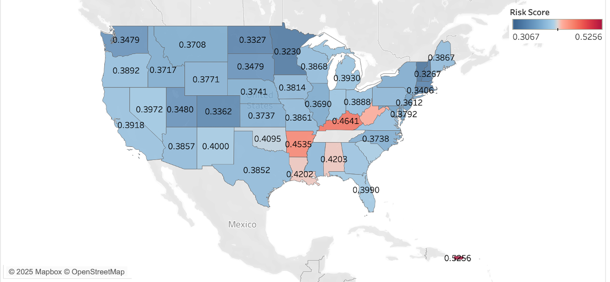

# Hi, I'm Terry Tu

I work on both sides of AI: using data to drive product decisions, and evaluating whether AI systems actually give the right answers.

Currently Human Data Manager at Micro1 (AI operations) · Georgia Tech MS Analytics '26 · previously DIRECTV (product analytics, content strategy) and Outlier / Scale AI (LLM code evaluation) · Los Angeles

**Open to:** product analyst, APM, and AI operations roles

**Tools:** Python · SQL · PostgreSQL · R · Power BI · Tableau · Streamlit

📫 terry.tu700@gmail.com · [LinkedIn](https://www.linkedin.com/in/tuterry/)

---

## Featured

### Project ARIA: AI diagnostic assistant for building HVAC data
Georgia Tech MS practicum sponsored by Joulea, built with two teammates. Building engineers spend 30–60 minutes digging through sensor data to diagnose each equipment fault. ARIA lets them ask a plain-English question and get back a structured diagnosis (the evidence, the likely cause, and a recommended check) in seconds.

- **My role:** Generation and frontend lead. Designed the Situation–Evidence–Inference–Action answer structure and hallucination guardrails, and built the Streamlit UI, chart rendering, and a mock data layer that let frontend and backend development run in parallel.
- **Results:** 90% accuracy (28 of 31) on SQL-verified questions, 3.42/4.0 on 12 human-scored diagnostic scenarios, and under 5% hallucination, meeting all project targets. Median response time of 10.9 seconds versus 30–60 minutes of manual investigation.
- **How it stays trustworthy:** SQL supplies the exact numbers, semantic search supplies context, and the language model only reasons over evidence it's handed. It never queries the database itself. Every answer separates evidence from interpretation, and ARIA declines to answer when the data can't support a conclusion.
<!-- ARIA LINK: when a shareable ARIA repo exists, delete this line and the "END ARIA LINK" line, then paste the repo URL in place of LINK.
- [Case study →](LINK)
END ARIA LINK -->

### Submission Review Toolkit (micro1)
A self-initiated JavaScript tool I built to automate quality review for a video and photo data-collection project. It runs in the browser, pulls each task's data, and checks submissions against the project's acceptance spec, so reviewers can focus on judgment calls instead of manual checks.

- **Engineering:** Rewrote it after a code review, fixing six bugs including regex injection, double-rounding, and cross-task data contamination.
<!-- IMPACT: once you have the number, delete this line and the "END IMPACT" line, then fill in the brackets.
- **Impact:** [time saved per review or volume handled]
END IMPACT -->
- *Code is private (internal tool).*

<!-- SQL AGENT: to show this section, delete this line and the "END SQL AGENT" line at the bottom of it.

### SQL Agent: plain-English questions over e-commerce data
An AI agent that answers business questions about the Google Merchandise Store's GA4 data, through an MCP server I built with Python and DuckDB.

- **How it works:** Claude connects to my MCP server, which gives it read-only tools to list tables, inspect columns, and run SQL. The agent discovers the data structure through those tools instead of relying on a hardcoded prompt. [ADD: one line on the metric definitions layer]
- **Result:** Scored [X] of [N] on a hand-verified set of business questions, up from [Y] before I added metric definitions.
- [Repo →](LINK) · [Demo video →](LINK)

END SQL AGENT -->

### Health Risk Prediction (CDC BRFSS)
Georgia Tech team project (team of four) on the CDC's 2024 BRFSS survey: 450K+ responses and 301 features. We predicted which respondents report fair or poor health from social and lifestyle factors, then mapped average predicted risk by state in Tableau, with each state's top three risk drivers shown on hover.

- **Modeling:** LASSO narrowed 300+ variables to 16 predictors. Since about 80% of respondents were healthy, we optimized for recall over accuracy: logistic regression caught 43% of high-risk respondents, random forest 51%, and XGBoost 77% (AUC 0.87), trading overall accuracy from 85% down to 77%.
- **Finding:** Income, education, and physical inactivity ranked alongside diabetes among the top risk drivers. Kentucky, Arkansas, and West Virginia had the highest predicted risk among continental states.

<!-- BRFSS LINK: if you publish the repo or a Tableau Public link, delete this line and the "END BRFSS LINK" line, then paste the URL in place of LINK.
- [Dashboard →](LINK)
END BRFSS LINK -->

