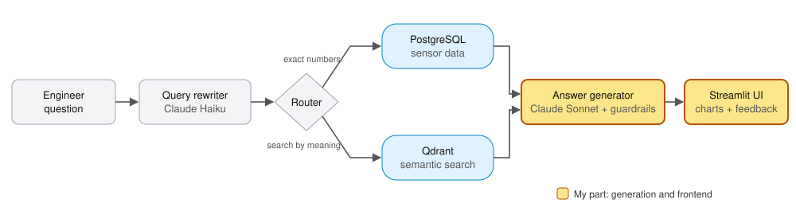

# Hi, I'm Terry Tu

I work on both sides of AI: using data to drive product decisions, and evaluating whether AI systems actually give the right answers.

Currently Human Data Manager at Micro1 (AI operations) · Georgia Tech MS Analytics '26 · previously DIRECTV (product analytics, content strategy) and Outlier / Scale AI (LLM code evaluation) · Los Angeles

**Open to:** product analyst, APM, and AI operations roles

**Tools:** Python · SQL · PostgreSQL · R · Power BI · Tableau · Streamlit

📫 terry.tu700@gmail.com · [LinkedIn](https://www.linkedin.com/in/tuterry/)

---

## Featured

### Project ARIA: AI diagnostic assistant for building HVAC data
Georgia Tech MS practicum sponsored by Joulea, built with two teammates. Building engineers spend 30–60 minutes digging through sensor data to diagnose each equipment fault. ARIA lets them ask a plain-English question and get back a structured diagnosis (the evidence, the likely cause, and a recommended check) in seconds.

- **My role:** Generation and frontend lead. Designed the Situation–Evidence–Inference–Action answer structure and hallucination guardrails, and built the Streamlit UI, chart rendering, and a mock data layer that let frontend and backend development run in parallel.
- **Results:** 90% accuracy (28 of 31) on SQL-verified questions, 3.42/4.0 on 12 human-scored diagnostic scenarios, and under 5% hallucination, meeting all project targets. Median response time of 10.9 seconds versus 30–60 minutes of manual investigation.
- **How it stays trustworthy:** SQL supplies the exact numbers, semantic search supplies context, and the language model only reasons over evidence it's handed. It never queries the database itself. Every answer separates evidence from interpretation, and ARIA declines to answer when the data can't support a conclusion.
<!-- ARIA LINK: when a shareable ARIA repo exists, delete this line and the "END ARIA LINK" line, then paste the repo URL in place of LINK.
- [Case study →](LINK)
END ARIA LINK -->

### Submission Review Toolkit (micro1)
A self-initiated JavaScript tool I built to automate quality review for a video and photo data-collection project. It runs in the browser, pulls each task's data, and checks submissions against the project's acceptance spec, so reviewers can focus on judgment calls instead of manual checks.

- **Engineering:** Rewrote it after a code review, fixing six bugs including regex injection, double-rounding, and cross-task data contamination.
<!-- IMPACT: once you have the number, delete this line and the "END IMPACT" line, then fill in the brackets.
- **Impact:** [time saved per review or volume handled]
END IMPACT -->
- *Code is private (internal tool).*

<!-- SQL AGENT: to show this section, delete this line and the "END SQL AGENT" line at the bottom of it.

### SQL Agent: plain-English questions over e-commerce data
An AI agent that answers business questions about the Google Merchandise Store's GA4 data, through an MCP server I built with Python and DuckDB.

- **How it works:** Claude connects to my MCP server, which gives it read-only tools to list tables, inspect columns, and run SQL. The agent discovers the data structure through those tools instead of relying on a hardcoded prompt. [ADD: one line on the metric definitions layer]
- **Result:** Scored [X] of [N] on a hand-verified set of business questions, up from [Y] before I added metric definitions.
- [Repo →](LINK) · [Demo video →](LINK)

END SQL AGENT -->

### Public Health Risk Forecasting (BRFSS)
Built and compared LASSO, Random Forest, and XGBoost models on 450K records from the CDC's BRFSS survey to predict health risk. The best model reached 77% recall, with the top risk drivers surfaced in a SHAP dashboard.
<!-- BRFSS LINK: if you publish the repo, delete this line and the "END BRFSS LINK" line, then paste the URL in place of LINK.
- [Repo →](LINK)
END BRFSS LINK -->

---

## Earlier work

**[Stock Research Dashboard](https://github.com/ttu700/Stock-Research-Dashboard)** · Power BI, Alpha Vantage API
Look up any ticker for 1–6 months of price history, news filtered by bullish or bearish sentiment, and an IPO and earnings calendar.

**[Spotify Listening History](https://github.com/ttu700/Spotify-Music-Analysis)** · Python, Spotify API, Power BI
Three years of my own listening (Jan 2021 to Jan 2024): 4,400+ hours across 7,600 artists. Linkin Park was my most-played artist, and I listened most on Mondays and least on Saturdays.

**[Amazon India Sales](https://github.com/ttu700/Amazon-India-Sales-Analysis)** · Power BI
Analysis of 128,975 orders ($912K in sales, April to June 2022). Sets drove about half of all revenue, Maharashtra and Karnataka were the top states, and about 72% of orders went through Amazon fulfillment rather than merchants.

**[Data Professional Survey](https://github.com/ttu700/Data-Professional-Breakdown-Dashboard)** · Power BI
Cleaned 630 usable responses from a survey of data professionals. Respondents rated salary satisfaction just 4.3 out of 10, below work-life balance at 5.7. Python was the clear favorite language, and data scientists reported the highest average salaries.

**[Earnings Announcements and Stock Prices](https://github.com/ttu700/Earnings-Impact-Across-Industries-Analysis)** · Python, hypothesis testing · team of five
Tested whether Q4 earnings surprises moved stock prices across five industries over ten years, three companies each. Only pharmaceuticals showed a significant effect (p = 0.018), a negative correlation between surprise and price change. The other four industries showed no pattern.
